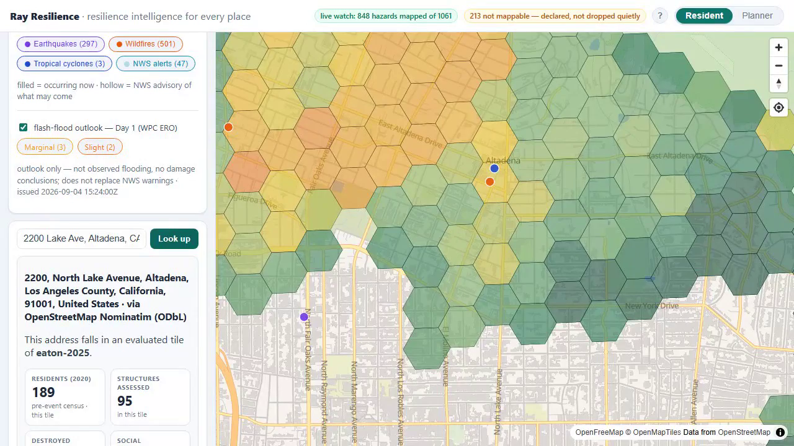
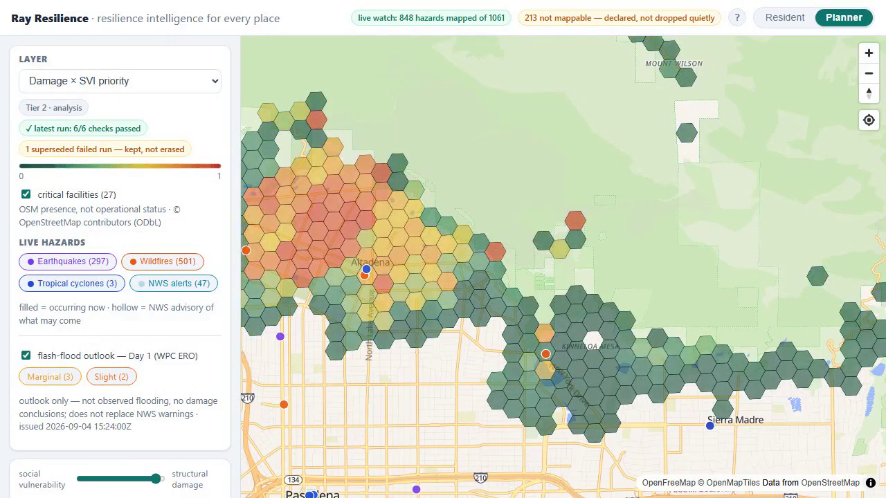
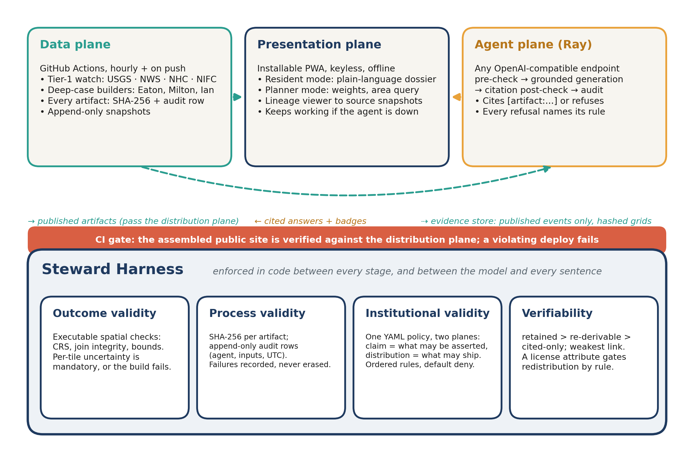

<div align="center">

# Ray Resilience

**Resilience intelligence for every place.**
An accountable GeoAI system for place-based disaster intelligence — a WebGIS / smartphone
app with an assistant, **Ray**, that may only say what the evidence supports, and a
**Steward Harness** that enforces it in code.

[](https://github.com/rayford295/ray-resilience/actions/workflows/test.yml)
[](https://github.com/rayford295/ray-resilience/actions/workflows/pages.yml)
[](https://github.com/rayford295/ray-resilience/actions/workflows/live.yml)
[](LICENSE)
[](https://rsvp.withgoogle.com/events/oasis-2026/)

**[Live site](https://rayford295.github.io/ray-resilience/)** · **[Open the app](https://rayford295.github.io/ray-resilience/app/)** · [Paper & submission materials](paper/) · [Technical manual](docs/manual/) · [Status](docs/STATUS.md)

</div>

---

## What it is

Most GeoAI disaster systems demonstrate *autonomy*: a language model that runs a spatial
pipeline. Ray Resilience demonstrates *accountability*. Every map layer traces back to a
hashed source snapshot; every sentence the assistant produces cites an artifact or is
refused; a declarative policy decides **who may be told what, at which resolution**; and a
CI gate keeps the public build inside that policy. When the system does not know, it says
so — as prominently as when it does.

| | |
|---|---|
|  |  |
| **Resident mode.** An address gets one of three answers — *covered*, *outside the evaluated areas*, or *not determined* — and, when covered, a plain-language dossier for its tile: residents, structures assessed, destroyed share, social vulnerability, critical facilities within 1 km, and the declared unknowns. Never a statement about a single parcel. | **Planner mode.** Damage × social-vulnerability priority on an H3 grid. The trade-off `t · damage + (1 − t) · SVI` is the planner's to set on a slider; every move is audit-logged. Lineage runs from any layer back to hashed source snapshots, including a rejected run the harness kept rather than erased. |

## Highlights

- **Nationwide hourly watch** — USGS earthquakes, NWS alerts, NHC tropical cyclones, NIFC/WFIGS wildfires, plus the NOAA/WPC Day-1 excessive-rainfall outlook as a separate, clearly bounded product. Per-source failures are declared, not hidden.
- **Three deep cases, one harness** — the **Eaton Fire (2025, CA)**, **Hurricane Milton (2024, FL)** and **Hurricane Ian (2022, FL)**: structure-damage ground truth, county debris volumes, CDC social vulnerability, 2020 census population and reliability-gated cross-view street imagery on H3 r9 grids. Analysis exists inside these areas and nowhere else, and the app says so.
- **Ask Ray** — a risk-analyst agent behind two deterministic gates: a policy pre-check before any model call, and a citation post-check after it. Refusals name the rule that triggered them. Works with any OpenAI-compatible endpoint; a local open model over Ollama by default, no key required.
- **Model output as governed evidence** — six open vision–language models graded 1,225 labelled street-view samples each under RAPID's verbatim prompts. The results are published as an evaluation and refused as a claim: [`docs/vlm_model_comparison.md`](docs/vlm_model_comparison.md).
- **The harness caught its own system three times** — a parcel-level file on the public site, an uncited reassurance that passed, an evidence store that read what the publisher withheld. Each incident is preserved and each fix is a control, not a patch: [`docs/incidents/`](docs/incidents/), [`docs/STATUS.md`](docs/STATUS.md).
- **A verifiable evaluation environment** — 363 Python and 67 app tests run in CI on every push, including a cell-by-cell policy-matrix sweep, adversarial claim checks, connector tests against real error envelopes, and an allowlist drift check.

## How it works

<p align="center"></p>

Three loosely coupled planes over one harness. The **data plane** (GitHub Actions) runs
the connectors and the deep-case builders and publishes hashed artifacts. The
**presentation plane** is an installable, keyless, offline-capable PWA (React + Vite +
MapLibre GL). The **agent plane** wraps any OpenAI-compatible model in policy pre-check →
grounded generation → citation post-check → audit. If the agent is down, the maps keep
working: graceful degradation is fail-closed design made visible.

The **Steward Harness** enforces four things between every stage and around every sentence:

| | What is enforced |
|---|---|
| **Outcome validity** | Executable spatial checks — CRS assertions, join integrity, sanity bounds, and a mandatory uncertainty block on every tile (a cell without one fails the build). |
| **Process validity** | SHA-256 lineage in an append-only audit log; failures recorded, never erased; the gateway's audit stores a point as its H3 cell and a question as a digest. |
| **Institutional validity** | One YAML policy, two planes of ordered rules with default deny. The **claim plane** scopes what may be asserted by role, evidence tier, resolution and geography; the **distribution plane** scopes what a build may publish, and CI fails the deploy on violation. |
| **Verifiability** | Each artifact carries `retained` > `re-derivable` > `cited-only` (weakest link) and a `license` attribute, so a claim resting on evidence nobody may keep says so. |

The policy is one file: [`src/geosteward/harness/policy_v1.yaml`](src/geosteward/harness/policy_v1.yaml).
The full mechanism is documented in the [technical manual](docs/manual/).

## The deep cases

| Case | Committed products | Declared limits |
|---|---|---|
| **Eaton Fire 2025** (CA, wildfire) | 18,428 CAL FIRE DINS points → 265-cell damage grid · CDC SVI 2022 across 20 tracts · 2,244 cross-view samples → 109-cell evidence grid · 46,341 residents · 27 OSM facilities | 40 inaccessible points; the repairable class has n = 30; tract-to-cell SVI is a declared downscaling |
| **Hurricane Milton 2024** (FL) | 2,556 labelled pre/post street-view pairs → 15-cell grid · 5,618 Pinellas cells with county debris volumes · 772,293 residents · 200 OSM facilities | post-event imagery is season-cumulative (Debby, Helene, Milton); a generated-imagery set was excluded, auditably |
| **Hurricane Ian 2022** (FL) | 886 matched samples → 190-cell evidence grid · 4,121 street-view positions as a density-only layer · 5,428 residents · 79 OSM facilities | density cells support coverage, not point-level severity |

All source imagery traces to a hashed dataset registry (134,272 files, ~33 GB, SHA-256).
Facilities are OpenStreetMap *presence*, never operational status. Population outside the
evaluated tiles is reported as a total, never mapped into cells the event has no evidence for.

## Quick start

```bash
git clone https://github.com/rayford295/ray-resilience && cd ray-resilience
python -m pip install -e ".[deepcase]"
python -m pytest -q                            # the evaluation environment: 363 tests
python scripts/publication_boundary.py plan    # which artifacts may be published, and why
cd app && npm ci && npm test && npm run dev    # the PWA at http://localhost:5173
```

The app serves the committed artifacts — no keys, no services. To talk to Ray as well:

```bash
ollama pull gpt-oss:20b                        # or any OpenAI-compatible endpoint
python -m pip install -e ".[deepcase,gateway]"
uvicorn gateway.main:app --port 8080
```

The deep-case builders read a ~33 GB corpus that is not redistributed here; third parties can
verify every committed artifact, hash and audit row, and can re-run the VLM evaluations from
the committed prediction records without a GPU.

## Repository map

```
├── app/                 # PWA: resident + planner modes, lineage viewer, Ask Ray panel
├── gateway/             # FastAPI agent gateway — LLM-agnostic, harness middleware
├── src/geosteward/      # pipeline · connectors · deep-case builders · harness/ (policy, audit, publication)
├── events/              # eaton-2025/ · milton-2024/ · ian-2022/ · palisades-2025/ (evaluation) · archive/
├── docs/                # STATUS.md · manual/ · incidents/ · design/ · demo/ · vlm_model_comparison.md
├── paper/               # OASIS Track A paper (LaTeX + Word draft), figures, eligibility statement
├── scripts/             # builders, the publication boundary, the VLM sweep and comparison
└── tests/               # 363 tests — doubles as the verifiable evaluation environment
```

## Paper and submission materials

- **RAY: Resilience Assistant for You — An Accountable GeoAI System for Place-Based Disaster Intelligence**, OASIS Challenge @ ACM SIGSPATIAL 2026, Track A: [`paper/ray-resilience-oasis2026.pdf`](paper/ray-resilience-oasis2026.pdf) (source and co-author Word draft alongside).
- Eligibility and contribution statement: [`paper/eligibility-and-contribution-statement.pdf`](paper/eligibility-and-contribution-statement.pdf).
- Demo video: produced by [`docs/demo/record_demo.py`](docs/demo/record_demo.py) as a scripted, genuine walk-through; how it is made is in [`docs/demo/README.md`](docs/demo/README.md).
- Six-model VLM comparison, regenerated from the committed evaluation files: [`docs/vlm_model_comparison.md`](docs/vlm_model_comparison.md).

Built on the RAPID line ([Yang et al., 2026](https://arxiv.org/abs/2606.21819)) — its prompts,
metric and acceptance rules become harness stages; its LLM task planner is deliberately not adopted.

## Team

**Yifan Yang** (Geography; team lead and corresponding author) · **Ziyi Wang** (Computer Science
and Engineering) · **Wenjing Gong** (Landscape Architecture and Urban Planning) · **Lei Zou**
(Geography; faculty advisor) — Texas A&M University.

This research is supported by the National Academies of Sciences, Engineering, and Medicine
Gulf Research Program (SCON-10000653, SCON-10001536) and the U.S. National Science Foundation
(2318206). Claude (Anthropic) was used as a coding and writing assistant; commits it contributed
to carry a `Co-Authored-By` trailer, and the authors take full responsibility for the code and text.

## License and disclaimer

MIT License. Ray Resilience is a research prototype — **not an official forecasting or warning
service**. In an emergency, follow official guidance (National Weather Service, National Hurricane
Center, FEMA, and local emergency management).
